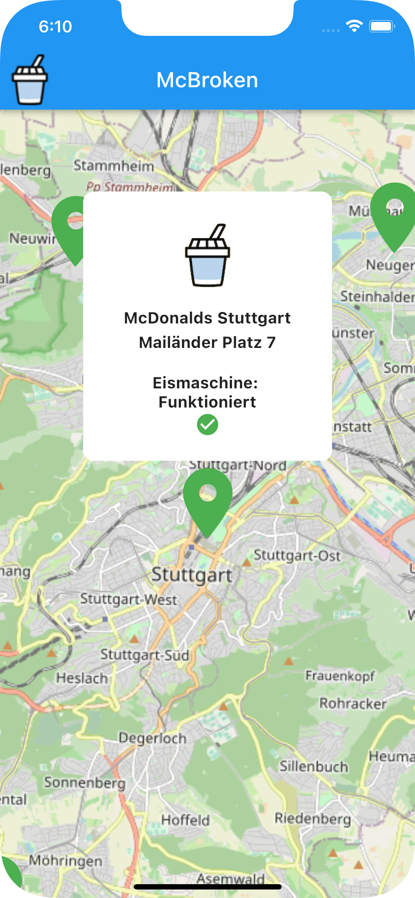
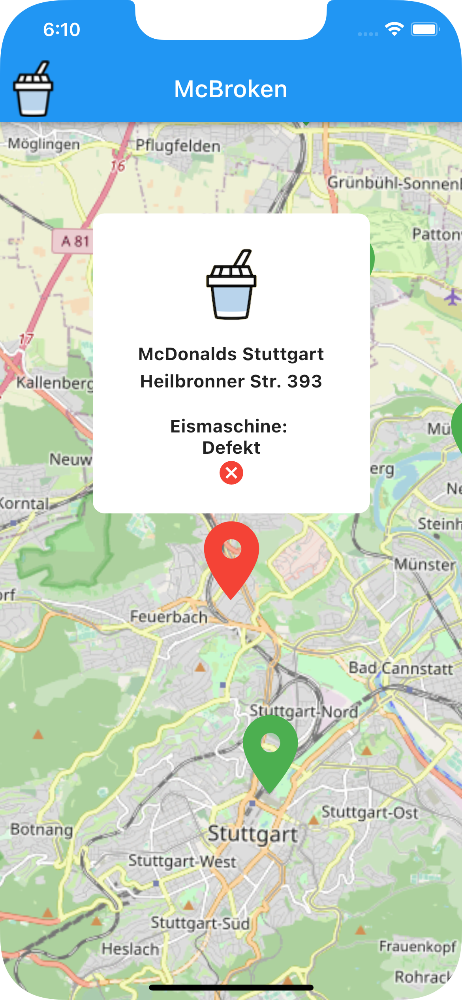

<h1 align="center">
  <a href="https://github.com/PlaxXOnline/mcbroken_app">
    
  </a>
</h1>

<div align="center">
  mcbroken_app
  <br />
  <a href="#about"><strong>Explore the screenshots »</strong></a>
  <br />
  <br />
  <a href="https://github.com/PlaxXOnline/mcbroken_app/issues/new?assignees=&labels=bug&template=01_BUG_REPORT.md&title=bug%3A+">Report a Bug</a>
  ·
  <a href="https://github.com/PlaxXOnline/mcbroken_app/issues/new?assignees=&labels=enhancement&template=02_FEATURE_REQUEST.md&title=feat%3A+">Request a Feature</a>
  .
  <a href="https://github.com/PlaxXOnline/mcbroken_app/issues/new?assignees=&labels=question&template=04_SUPPORT_QUESTION.md&title=support%3A+">Ask a Question</a>
</div>

<div align="center">
<br />

[](LICENSE)

[](https://github.com/PlaxXOnline/mcbroken_app/issues?q=is%3Aissue+is%3Aopen+label%3A%22help+wanted%22)
[](https://github.com/PlaxXOnline)

</div>

<details open="open">
<summary>Table of Contents</summary>

- [About](#about)
  - [Built With](#built-with)
- [Getting Started](#getting-started)
  - [Installation](#installation)
- [Usage](#usage)
- [Roadmap](#roadmap)
- [Support](#support)
- [Project assistance](#project-assistance)
- [Contributing](#contributing)
- [Authors & contributors](#authors--contributors)
- [Security](#security)
- [License](#license)
- [Acknowledgements](#acknowledgements)

</details>

---

## About

Haven't you ever driven to a McDonalds on a hot summer day with a craving for ice cream? Or a McFlurry?

Yes?

Then one or the other of these trips was probably completely wasted because the ice cream machine was broken, right?

With this app, that's guaranteed not to happen again.
With the brilliant idea of [Rashiq](https://github.com/rashiq) to develop an API that programmatically checks if the ice machine of McDonalds is working, all these unnecessary empty trips are passeé.
Rashiq only had a website available at the time of development, so I thought I'd give this project a cross platform app.

<details>
<summary>Screenshots</summary>
<br>

|                          Machine is working                           |                        Machine is not working                          |
| :-------------------------------------------------------------------: | :--------------------------------------------------------------------: |
|  |  |

|                               Clustering                              |
| :-------------------------------------------------------------------: |
|  |

</details>

### Built With

This Application was build with:

- [Flutter](https://www.flutter.dev/)
- [BLoC](https://pub.dev/packages/bloc)
- [flutter_bloc](https://pub.dev/packages/flutter_bloc)
- [connectivity_plus](https://pub.dev/packages/connectivity_plus)
- [flutter_map](https://pub.dev/packages/flutter_map)
- [http](https://pub.dev/packages/http)
- [latlong2](https://pub.dev/packages/latlong2)
- [flutter_map_marker_cluster](https://pub.dev/packages/flutter_map_marker_cluster)
- [flutter_map_location_marker](https://pub.dev/packages/flutter_map_location_marker)
- [flutter_native_splash](https://pub.dev/packages/flutter_native_splash)
- [google_fonts](https://pub.dev/packages/google_fonts)

## Getting Started

### Installation

First, download and install [Flutter](https://www.flutter.dev/).
Then Clone the Repository:

```sh
git clone <https://github.com/PlaxXOnline/mcbroken_app.git>
```

Run

```sh
flutter pub get
```

Start your Simulator or connect your Smartphone and hit the run button.

## Usage

If everything is successfully installed, you can just start your IDE and Simulator and press the run button.

## Roadmap

- [x] Popups
- [x] Clustering
- [ ] Settings
- [x] Localizations
- [x] Show Actual Position
- [x] SplashScreen
- [ ] Search
- [ ] Support more Countries

See the [open issues](https://github.com/PlaxXOnline/mcbroken_app/issues) for a list of proposed features (and known issues).

- [Top Feature Requests](https://github.com/PlaxXOnline/mcbroken_app/issues?q=label%3Aenhancement+is%3Aopen+sort%3Areactions-%2B1-desc) (Add your votes using the 👍 reaction)
- [Top Bugs](https://github.com/PlaxXOnline/mcbroken_app/issues?q=is%3Aissue+is%3Aopen+label%3Abug+sort%3Areactions-%2B1-desc) (Add your votes using the 👍 reaction)
- [Newest Bugs](https://github.com/PlaxXOnline/mcbroken_app/issues?q=is%3Aopen+is%3Aissue+label%3Abug)

## Support

- [GitHub issues](https://github.com/PlaxXOnline/mcbroken_app/issues/new?assignees=&labels=question&template=04_SUPPORT_QUESTION.md&title=support%3A+)
- Contact options listed on [this GitHub profile](https://github.com/PlaxXOnline)

## Project assistance

If you want to say **thank you** or/and support active development of mcbroken_app:

- Add a [GitHub Star](https://github.com/PlaxXOnline/mcbroken_app) to the project.
- Tweet about the mcbroken_app.
- Write interesting articles about the project on [Dev.to](https://dev.to/), [Medium](https://medium.com/) or your personal blog.

Together, we can make mcbroken_app **better**!

## Contributing

First off, thanks for taking the time to contribute! Contributions are what make the open-source community such an amazing place to learn, inspire, and create. Any contributions you make will benefit everybody else and are **greatly appreciated**.

Please read [our contribution guidelines](CONTRIBUTING.md), and thank you for being involved!

## Authors & contributors

The original setup of this repository is by [Janik Kahle](https://github.com/PlaxXOnline).

The mcbroken API is by [Rashiq](https://github.com/rashiq).

For a full list of all authors and contributors, see [the contributors page](https://github.com/PlaxXOnline/mcbroken_app/contributors).

## Security

mcbroken_app follows good practices of security, but 100% security cannot be assured.
mcbroken_app is provided **"as is"** without any **warranty**. Use at your own risk.

_For more information and to report security issues, please refer to our [security documentation](SECURITY.md)._

## License

This project is licensed under the **MIT license**.

See [LICENSE](LICENSE) for more information.

## Acknowledgements

A very special thanks goes to [Rashiq](https://github.com/rashiq), without his API and idea this would have been nowhere near as easy.
